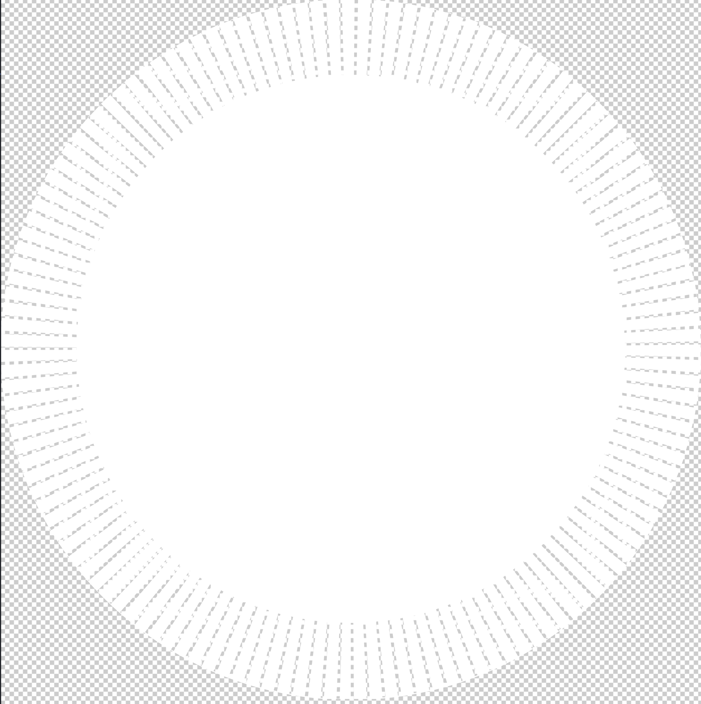

## Задание на вёрстку

Это задание проверяет, насколько хорошо вы умеете верстать и знаете особенности браузеров.

Вам нужно сверстать панель управления «умным домом». Она показывает информацию о текущем состоянии дома и позволяет управлять устройствами вручную и по сценариям. Дизайнер подготовил для вас отдельные макеты для большого экрана и мобильных телефонов.

**Ссылки**

- [Макеты](https://yandex-shri-2018.github.io/entrance-task-2-2/guide/)
- [Пример анимации открытия попапа](https://yandex-shri-2018.github.io/entrance-task-2-2/Animation.mp4)
- [Репозиторий на GitHub](https://github.com/yandex-shri-2018/entrance-task-2-2)

### Компоновка страницы

- В верхней части страницы есть шапка. В ней находится логотип и главное меню. Для адресов ссылок используйте заглушку #.

- В нижней части находится подвал. Он должен примыкать к нижней границе экрана, вне зависимости от количества контента на странице.

- Вертикальный скролл есть только в мобильной версии, при прокрутке шапка остаётся на месте. Главное меню прячется за иконку ☰.

### Содержимое страницы

На странице отображаются три блока:

- «Главное»,
- «Избранные сценарии»,
- «Избранные устройства».

### Главное

- Блок «Главное» находится слева и занимает половину экрана. В нём в виде текста отображается состояние окон и дверей, температура в доме и на улице. Справа находится список ближайших запланированных сценариев, который можно листать по вертикали. На мобильных устройствах блок занимает всю ширину экрана, а список ближайших сценариев листается по горизонтали.
- Избранные сценарии:
  - Правую половину экрана занимает блок «Избранные сценарии». Сами сценарии отображаются в виде панелей фиксированного размера, которые расположены в три ряда.
  - Цвет иконки показывает, активен ли сценарий сейчас.
- Если все сценарии не помещаются в три ряда, то справа сверху появляются кнопки для постраничного листания.
- Переход между страницами должен быть анимированным. Вид и параметры анимации выберите самостоятельно.

### Избранные устройства

- Устройства, как и сценарии, отображаются в виде панелей фиксированного размера. Они расположены в один ряд по всей ширине экрана. Если устройства не помещаются, справа над списком появляются кнопки для постраничного листания — как в списке сценариев. На мобильных устройствах вместо постраничного листания используется горизонтальная прокрутка списка.
- Список устройств можно фильтровать по комнатам и типам устройств. В мобильной версии фильтр отображается в виде меню. Для меню нет макета — реализуйте его на свое усмотрение.
- При клике на устройство должен открываться попап управления им. Открытие попапа должно сопровождаться анимацией. Пример анимации есть в репозитории с макетами.
- Яркость ламп и температура теплого пола выбираются при помощи слайдера. Термостатом можно управлять при помощи крутилки.

### Критерии

- В первую очередь мы будем проверять, свёрстаны ли страницы в точном соответствии с макетами. Если какие-то части макетов покажутся вам непонятными, обязательно задавайте уточняющие вопросы — пишите на адрес frontendschool@yandex-team.ru.
- Вёрстка должна корректно выглядеть:
  - На десктопе — в последних версиях Google Chrome, Яндекс.Браузера, Mozilla Firefox, Safari, Microsoft Edge.
  - На мобильных устройствах — в Safari (iOS) и Google Chrome (Android).
- В этом задании мы проверяем ваши навыки вёрстки. Вы можете использовать JavaScript, если посчитаете это нужным, но старайтесь, чтобы код был как можно проще. Пожалуйста, не используйте JavaScript-фреймворки.
- По возможности используйте приёмы безопасной деградации CSS.
- Уделите внимание организации и оформлению кода. Оптимизация производительности и автоматизация будут плюсом.

## Получившийся сайт на gh-pages

[_https://moonw1nd.github.io/crispy-octo-chainsaw/_](https://moonw1nd.github.io/crispy-octo-chainsaw/)

## Как запустить

### Установка зависимостей

```
  npm install
```

### Сборка Development билда c запуском DEV сервера и вотчера

> открывается на 3000 порту ([http://localhost:3000/](http://localhost:3000/))

```
  npm start
```

### Сборка Production билда

```
  npm run-script build
```

### Дополнительно

- Удалить `build` папку

```
  npm run-script clean
```

- Запуск валидатора HTML

```
  npm run-script htmlv
```

## Выполнение задания

### 1. Настройка окружения

Исходя из цели задачи: "Проверка, умения верстать и знание особенностей браузеров", я решил использовать сборщик [**Gulp**](https://gulpjs.com/), для сборки проекта, оптимизации рутинных задач, а так же запуска Dev-сервера. Так как раньше я с ним уже работал, он прост в конфигурации, а так же не предвидится писать много JS для сборки его в отдельный `bundle`.

В реализации данного задания используются следующие плагины:

- [browser-sync](https://www.npmjs.com/package/browser-sync) - для запуска Dev-сервера и Live-reload.
- [gulp-sass](https://www.npmjs.com/package/gulp-sass) - для компиляции препроцессора SASS в CSS
- [gulp-csso](https://www.npmjs.com/package/gulp-csso) - минификация CSS
- [gulp-imagemin](https://www.npmjs.com/package/gulp-imagemin) - минификация изображений и SVG
- [gulp-newer](https://www.npmjs.com/package/gulp-newer) - для копирования новых файлов в билд при разработке
- [gulp-autoprefixer](https://www.npmjs.com/package/gulp-autoprefixer) - автоматическое добавление вендорных префиксов к CSS
- [gulp-plumber](https://www.npmjs.com/package/gulp-plumber) - дает возможность продолжить работу gulp при ошибке в коде.
- [gulp-clean](https://github.com/peter-vilja/gulp-clean) - очистка директории билда перед сборкой.
- [gulp-rename](https://www.npmjs.com/package/gulp-rename) - для переименования файлов, добавления суффикса `.min` к сжатым файлам.
- [gulp-html-validator](https://www.npmjs.com/package/gulp-html-validator) - HTML валидатор.
- [gulp-uglify](https://www.npmjs.com/package/gulp-uglify) - минификация js.
- [gulp-htmlnano](https://www.npmjs.com/package/gulp-htmlnano) - минификация HTML.
- [gulp-environments](https://www.npmjs.com/package/gulp-environments) - гибкая настройка gulp конфига под development и production сборки.
- [babel](https://babeljs.io/): - транспиляция JS
  - [babel-core](https://www.npmjs.com/package/babel-core)
  - [babel-preset-env](https://www.npmjs.com/package/babel-preset-env)
  - [babelify](https://www.npmjs.com/package/babelify)
- [browserify](https://www.npmjs.com/package/browserify): - поддержка модульной разработки JS
  - [vinyl-buffer](https://www.npmjs.com/package/vinyl-buffer)
  - [vinyl-source-stream](https://www.npmjs.com/package/vinyl-source-stream)
- [hummer.js](https://hammerjs.github.io/) - использовал для кроссбраузерного распознавания жестов.

Так же установил дополнительно пакеты [`husky`](https://www.npmjs.com/package/husky), [`lint-staged`](https://www.npmjs.com/package/lint-staged) и [`Prettier`](https://www.npmjs.com/package/prettier) для реализации автоматизированного приведения к единому стилю с помощью запуска `Prettier` в `precommit hook`.

### 2. Архитектура

Архитектура построена на компонентном подходе.

Методология - БЭМ.

_**Файловая структура:**_

```
  src/
  |__ components/
  |   |__ componentName/
  |   |   |__ componentName.njk   // файл с разметкой представления
  |   |   |__ componentName.sass  // файл со стилями компонента
  |   |   |__ componentName.js    // файл со сценариями для компонента
  |    ...
  |__ data/
  |   |__ assets/                 // папка со всеми картинками
  |   |__ data                    // все данные нужные для построения страницы препроцессором HTML
  |   ...
  |
  |__ layouts/
  |   |__ default.njk             // файл с разметкой для типовой страницы
  |
  |__ pages/                      // папка с основным контентом страниц
  |   |__ index/
  |   |   |__ pageContent.njk
  |   |   |__ pageContent.sass
  |   |   |__ pageContent.js
  |   ...
  |
  |__ partials/                   // папка в которой содержатся файлы частей шаблона: шапки и подвала
  |   |__ Header/...
  |   |   |__ Header.njk
  |   |   |__ Header.sass
  |   |   |__ Header.js
  |   |
  |   |__ Footer/...
  |   |__ Head.njk                // в котором хранятся все мета-теги страниц
  |   ...
  |__ index.html                // точка входа для препроцессора HTML
  |__ index.scss                // определение общих констант и стилей
  |__ index.js                  // навешивание всех обработчиков событий компонентов
  ...
```

_**Описание компонентов:**_

Компоненты описываются с помощью Nunjucks `macro`([Doc](https://mozilla.github.io/nunjucks/templating.html#macro)), и имеют следующую сигнатуру:

```


<div class="Block {{ bem.mix }} {{ bem.mod }}">{{ data }}</div>


```

где:

- bem - это объект в который передаются БЭМ миксы и модификаторы.
  - mod - свойство объекта `bem` отвечает за модификаторы
  - mix - свойство объекта `bem` отвечает за миксы
- data - вся нужная информация для построения компонента
- a11y - параметры нужные для accessability

### 3. Верстка

- Для построения сетки сайта, использовал `flexbox`.
- для проверки корректности верстки использовал PixelPerfect
- Пришлось править svg: так как там был `background: #F8F8F8`, а должен был прозрачный.
- Не нашел спрайтов для `favicon`, поэтому сам нарисовал подобный в `Adobe Photoshop`
- Так как не надо поддерживать `ie11` можно сделать эффект размытия с помощью filter: blur();
- Текст светлых цветов отображается в webkit-е отлично от текста темных цветов, он выглядит жирнее. Так же на Mac OS используется субпиксельный рендеринг для шрифтов, что делает отображение шрифта разным на разных платформах. Чтобы это как-то невелировать использовал стиль `-webkit-font-smoothing: antialiased;` и `-moz-osx-font-smoothing: grayscale;`
- Для блоков в которых текст подвергается изменению в зависимости от размера окна, для обеспечения оптимального изменения размеров шрифта использовал формулу: `calc(minFontSize + (maxFontSize - minFontSize) * (100vw - minScreenSize) / (maxScreenSize-minScreenSize))`.
- В качестве брейкпойинтов в media-запросах использовал `850px`(планшетная версия) и `650px`(мобильная версия).
- Убрал `outline` со всех элементов и заменил на более приятный и корректно отображающийся `box-shadow`.
- `outline` отключается на экранах меньше 850px так как считаю что это будут мобильные устройства и он там не нужен, в реальном проеткте можно более хитро определять, что сайт открыт на мобильных устройствах.
- Так как нет возможности в данном задании определить с какого устройства зашел человек, либо touch, либо desktop, то ховер на элементах убирается на брейкпоинте в `850px`, чтобы избежать проблемы с "залипающим"(состояние ховера остается после касания на элемент и сохраняется пока не произойдет следующее действие) `hover` на тач устройствах в некоторых браузерах.
- Адаптивность меню фильтров в "Избранных устройствах" работает на чистом CSS, с помощью media-запросов, и манипуляции свойством `order`.
- Анимация модального окна выполнена с помощью `transform: translate3d` так как это позволяет подключить GPU-ускорение для рендеринга анимации.
- Для управления удобством работы с клавиатуры использовал `tabindex`
- Для a11y использовал тэги `aria-label` - для пояснения смысла блоков, для скринридеров. `aria-hidden` - для скрытия ненужного контента от скринридеров.
- для реализации регулятора света и температуры(не крутящийся) использовал `input[type="range"]`. (компонент RangeController)
- для реализации вращательного контроллера(компонент RotationalController):
  - инвертировал SVG подобным образом:
    
  - на слое ниже нарисовал SVG круг, темного цвета
  - для того чтобы имитировать заполнение манипулировал обводкой круга свойством svg `stroke-dasharray`, желтого цвета.
- На десктопной версии для перелистывания Избранных устройств и Избранных сценариев используются исключительно стрелки
- Так как для подвала на мобильных устройствах не было макета - реализовал на свое усмотрение.
- Дополнительно: так как не было описано как должно открываться меню-гамбургер, то реализовал открытие на свое усмотрение.

### 4.Итоги

- Сайт сверстан по макетам c использованием PixelPerfect
- Сайт сделан адаптивным
- Сайт проверен на валидность HTML
- Реализована поддержка удобной работы с клавиатуры (кроме RotationalController);
- Реализована поддержка удобной работы на мобильных версиях
- Улучшено a11y для скринридеров
- В Production сборке реализована минификация и оптимизация SVG, HTML, JS, изображений.
- Сайт опубликован на gh-pages ([https://moonw1nd.github.io/crispy-octo-chainsaw/](https://moonw1nd.github.io/crispy-octo-chainsaw/))
- Сайт тестировался на десктоп:
  - Chrome
  - Safari
  - Yandex Browser
  - Opera
  - Edge
- Сайт тестировался на мобильных:
  - Android 7.1.2
  - iPad 2
  - iPhone 6
